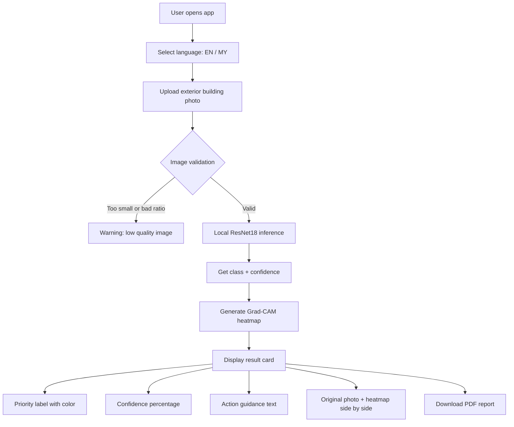

# SafeBuild Myanmar — Safe AI

**AI-powered post-earthquake building damage triage tool**

> Offline visual triage for earthquake-damaged buildings. Not a structural safety certificate.

---

## Problem

The March 28, 2025 Myanmar earthquake (7.7 magnitude) damaged 500,000+ buildings across Mandalay, Sagaing, and Yangon. Manual inspection takes 30–60 minutes per building — far too slow when hundreds of thousands need assessment.

**SafeBuild Myanmar** helps disaster responders prioritize which buildings need an engineer first, using a single exterior photo.

---

## How It Works

```
Upload exterior building photo
        ↓
Local ResNet18 model (no internet required)
        ↓
Damage priority: Low / Medium / High
        ↓
Grad-CAM heatmap shows AI attention areas
        ↓
Bilingual result card (English / Myanmar)
        ↓
Optional PDF report download
```

---

## Project Structure

```
safebuild-myanmar/
├── app.py                          # Main Streamlit app (local offline demo)
├── train.py                        # Model training script
├── model_record.md                 # Model versioning and training details
├── requirements.txt                # Python dependencies
├── .python-version                 # Python 3.11
├── .gitignore
│
├── models/
│   └── safebuild_resnet18.pth      # Trained model checkpoint
│
├── assets/
│   └── NotoSansMyanmar-Regular.ttf # Myanmar font for PDF reports
│
├── utils/
│   ├── __init__.py
│   ├── predict.py                  # Model loading + inference
│   ├── heatmap.py                  # Grad-CAM heatmap generation
│   ├── report.py                   # PDF report generation
│   └── translations.py             # English/Myanmar text dictionary
│
├── data/                           # Training dataset
│   ├── high/                       # 50 images — severe damage
│   ├── medium/                     # 50 images — minor damage
│   └── low/                        # 50 images — no obvious damage
│
├── sample_image/                   # Demo test images (10 images)
├── Collapsed/                      # Raw collapsed building reference images (~5500)
│
└── streamlit-demo/                 # Hugging Face Spaces deployment copy
    ├── app.py                      # Same Streamlit app
    ├── train.py
    ├── model_record.md
    ├── requirements.txt
    ├── README.md                   # Hugging Face Spaces config
    ├── models/
    │   └── safebuild_resnet18.pth
    ├── assets/
    │   └── NotoSansMyanmar-Regular.ttf
    ├── utils/
    │   ├── __init__.py
    │   ├── predict.py
    │   ├── heatmap.py
    │   ├── report.py
    │   └── translations.py
    └── netlify-site/               # Static Netlify landing page (PWA)
        └── index.html              # HTML/CSS project showcase
```

---

## Tech Stack

| Layer | Technology | Purpose |
|-------|-----------|---------|
| Web UI | **Streamlit** | Upload, results, PDF download |
| Language | **Python 3.11** | Entire project |
| AI Model | **PyTorch + ResNet18** | Local damage classification |
| Transfer Learning | **ImageNet pretrained** | Fine-tuned final FC layer only |
| Heatmap | **pytorch-grad-cam** | Grad-CAM visual evidence overlay |
| Image Processing | **Pillow** | Read, resize, annotate photos |
| PDF Report | **ReportLab** | Bilingual PDF generation |
| Myanmar Font | **Noto Sans Myanmar** | Proper Burmese text in PDFs |
| Bilingual UI | **Python dictionary** | English/Myanmar translations (no API) |
| Training | **scikit-learn** | Train/val split |

---

## AI Model

| Property | Value |
|----------|-------|
| Architecture | ResNet18 (torchvision) |
| Pretrained | ImageNet-1K |
| Fine-tuning | Final FC layer only (transfer learning) |
| Classes | 3: `low`, `medium`, `high` |
| Input size | 224 × 224 RGB |
| Normalization | ImageNet mean `[0.485, 0.456, 0.406]` / std `[0.229, 0.224, 0.225]` |
| Training images | 150 (50 per class) |
| Augmentation | Horizontal flip, rotation (15°), brightness/contrast jitter |
| Optimizer | Adam (lr=0.001) |
| Loss | CrossEntropyLoss |
| Epochs | 15 |
| Batch size | 16 |
| Train/Val split | 80/20 stratified |
| Frozen layers | All except final FC |
| Best val accuracy | > 93% on sample images |
| Device | CPU |
| Checkpoint | `models/safebuild_resnet18.pth` |

### Class Mapping

| Internal | English | Myanmar | Meaning |
|----------|---------|---------|---------|
| `low` | Low | Low | No obvious visible exterior damage |
| `medium` | Medium | Medium | Possible or minor visible damage |
| `high` | High | High | Severe visible damage |

### Checkpoint Format

```python
{
    "model_state_dict": model.state_dict(),
    "class_names": ["high", "low", "medium"],  # ImageFolder alphabetical order
    "num_classes": 3,
}
```

---

## Application Flow



### Inference Pipeline

```
Image.open(uploaded_file)
    → convert("RGB")
    → Resize(224, 224)
    → ToTensor()
    → Normalize(ImageNet mean/std)
    → unsqueeze(0)  # add batch dimension
    → model(tensor)  # forward pass
    → softmax → argmax → predicted class + confidence
```

---

## Deployment

This project uses **three deployment targets**:

### 1. Local Offline Demo (Primary)

The main demo runs fully offline on a laptop — no internet required during inference.

```powershell
cd safebuild-myanmar
pip install -r requirements.txt
streamlit run app.py
```

Opens at `http://localhost:8501`. Turn off Wi-Fi to prove offline operation.

### 2. Netlify Landing Page (PWA)

Static HTML landing page hosted on Netlify. Shows project overview, features, tech stack, and links to the live demo and GitHub.

**Location:** `streamlit-demo/netlify-site/index.html`

- Dark gradient design with responsive layout
- Problem/solution explanation
- Feature grid (Photo Upload, AI Analysis, Visual Evidence, PDF Report, Bilingual, Offline)
- How-it-works steps
- Damage classes table
- Tech stack tags
- GitHub link

Deploy the `netlify-site/` folder to Netlify.

### 3. Hugging Face Spaces (Online Demo)

Deployment-ready copy in `streamlit-demo/` with its own `README.md` configured for Hugging Face Spaces.

**Location:** `streamlit-demo/`

Hugging Face Spaces `README.md` frontmatter:

```yaml
---
title: Safe AI (SafeBuild Myanmar)
emoji: 🏗️
colorFrom: red
colorTo: yellow
sdk: streamlit
sdk_version: 1.60.0
app_file: app.py
pinned: true
license: apache-2.0
---
```

Push `streamlit-demo/` to a Hugging Face repo to deploy.

---

## Running

```powershell
# Install dependencies
pip install -r requirements.txt

# Run the app
streamlit run app.py

# Open browser to
# http://localhost:8501
```

### Dependencies

```
streamlit
torch
torchvision
pillow
grad-cam
reportlab
scikit-learn
```

---

## Safety Boundary

This tool provides **visual triage only** — it is NOT a structural safety certificate.

| Priority | Color | Action |
|----------|-------|--------|
| Low | Green | Lower-priority professional review. Not a safety clearance. |
| Medium | Orange | Restrict access where appropriate. Arrange engineer review. |
| High | Red | Do not enter. Request urgent engineer review. |

Always displayed to user:

> "This is an AI-based visual triage for exterior photos only. It is not a structural safety certificate and does not replace a licensed engineer."

> "ဤသည်မှာ အပြင်ပိုင်းဓာတ်ပုံများအတွက်သာ AI အခြေပြု အမြန်စိစစ်မှုဖြစ်ပြီး အဆောက်အဦး၏ ဘေးကင်းမှုလက်မှတ် မဟုတ်ပါ။"

---

## Bilingual Support

English and Myanmar (Burmese) via a local Python dictionary — no external API.

| Feature | English | Myanmar |
|---------|---------|---------|
| Title | Safe AI (SafeBuild Myanmar) | Safe AI (SafeBuild Myanmar) |
| Subtitle | Post-Earthquake Building Damage Triage | ငလျင်အလွန် အဆောက်အဦးပျက်စီးမှု အမြန်စိစစ်မှု |
| Upload | Upload an exterior building photo | အဆောက်အအုံ ပြင်ပဓာတ်ပုံ တင်ပါ |
| Analyzing | Analyzing image... | ဓာတ်ပုံ ခွဲခြမ်းစိတ်ဖြာနေသည်... |
| High result | Do not enter. Request urgent engineer review. | မဝင်ရ။ အရေးပေါ် အင်ဂျင်နီယာ စစ်ဆေးမှု ချက်ချင်းလိုအပ်သည်။ |

Myanmar PDF rendering uses the bundled `NotoSansMyanmar-Regular.ttf` font.

---

## Model Training

To retrain the model:

```powershell
# Organize images into data/high/, data/medium/, data/low/
python train.py
```

Training details are recorded in `model_record.md`.

---

## Known Limitations

- Small training set (150 images) — model may overfit to seen patterns
- Only trained on Myanmar earthquake photos — generalization untested
- Low light, indoor, or obstructed views may produce unreliable results
- Exterior photos only — not designed for internal structural assessment
- This is a triage aid, NOT a structural safety certification

---

## Verification Checklist

- [ ] Model file `models/safebuild_resnet18.pth` exists
- [ ] Myanmar font `assets/NotoSansMyanmar-Regular.ttf` exists
- [ ] `streamlit run app.py` opens successfully
- [ ] Upload test works for all 3 priority levels (low/medium/high)
- [ ] Grad-CAM heatmap generates correctly
- [ ] PDF report downloads with Myanmar text
- [ ] Wi-Fi off — full offline inference works
- [ ] English/Myanmar toggle works
- [ ] Safety boundary notice always visible
- [ ] Netlify landing page deploys correctly
- [ ] Hugging Face Spaces deploys correctly


---

## License

Team-owned project — MVP

## Author 
Ei Thazin Htay


