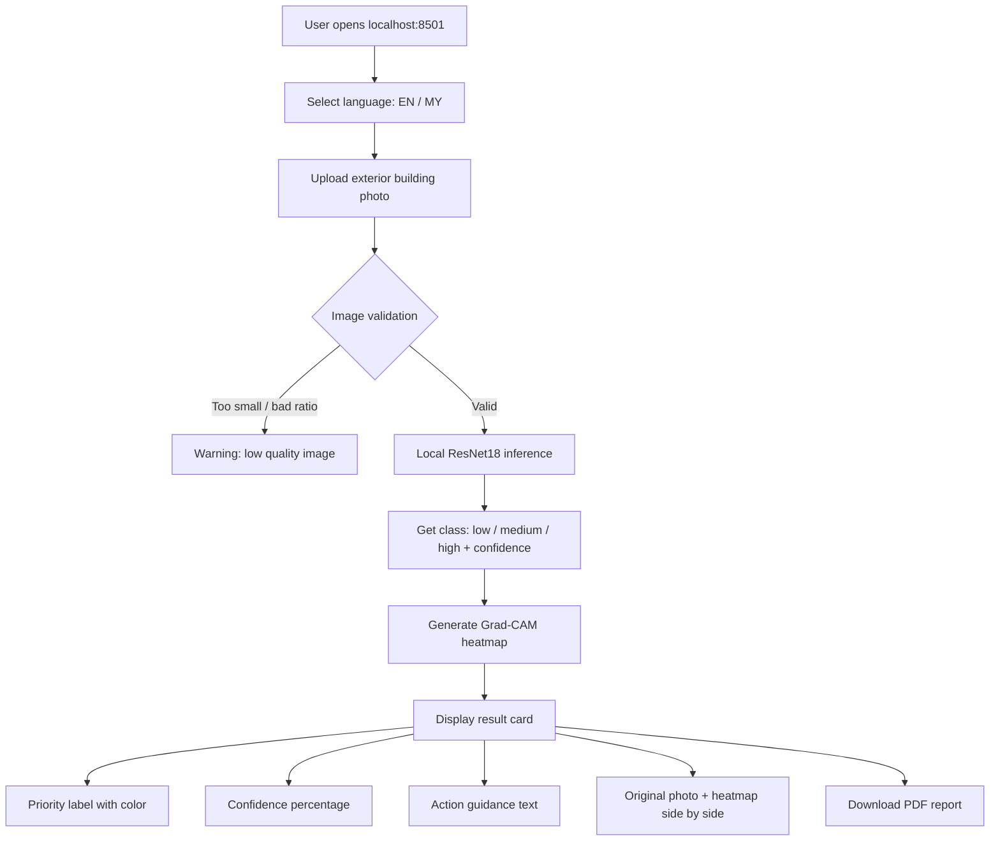

# SafeBuild Myanmar — Safe AI

**AI-powered post-earthquake building damage triage tool**

> Offline visual triage for earthquake-damaged buildings. Not a structural safety certificate.

---

## Problem

The March 28, 2025 Myanmar earthquake (7.7 magnitude) damaged 500,000+ buildings across Mandalay, Sagaing, and Yangon. Manual inspection takes 30–60 minutes per building — far too slow when hundreds of thousands need assessment.

**SafeBuild Myanmar** helps disaster responders prioritize which buildings need an engineer first, using a single exterior photo.

---

## How It Works

```
Upload exterior building photo
        ↓
Local ResNet18 model (no internet)
        ↓
Damage priority: Low / Medium / High
        ↓
Grad-CAM heatmap shows AI attention areas
        ↓
Bilingual result card (English / Myanmar)
        ↓
Optional PDF report download
```

1. **Upload** — Take or upload a street-level exterior building photo
2. **Analyze** — Local AI model classifies visible damage in < 3 seconds
3. **Result** — Color-coded priority with action guidance
4. **Evidence** — Grad-CAM heatmap highlights what the AI focused on
5. **Report** — Download a bilingual PDF with photo, result, and next steps

---

## Tech Stack

| Layer | Technology | Purpose |
|-------|-----------|---------|
| Web UI | **Streamlit** | Upload, results, PDF download |
| Language | **Python 3.10** | Entire project |
| AI Model | **PyTorch + ResNet18** | Local damage classification |
| Transfer Learning | **ImageNet pretrained** | Fine-tuned final FC layer |
| Image Processing | **Pillow** | Read, resize, annotate photos |
| Visual Explanation | **pytorch-grad-cam** | Grad-CAM heatmap overlay |
| PDF Report | **ReportLab** | Local bilingual PDF generation |
| Myanmar Font | **Noto Sans Myanmar** | Proper Burmese text rendering |
| Bilingual UI | **Python dictionary** | English/Myanmar translations |
| Offline Mode | **Local Streamlit server** | Works at `localhost:8501` without internet |

---

## Project Structure

```
safebuild-myanmar/
├── app.py                  # Main Streamlit application
├── train.py                # Model training script
├── model_record.md         # Model documentation and versioning
├── requirements.txt        # Python dependencies
├── models/
│   └── safebuild_resnet18.pth   # Trained model checkpoint
├── assets/
│   └── NotoSansMyanmar-Regular.ttf  # Myanmar PDF font
├── utils/
│   ├── __init__.py
│   ├── predict.py          # Model loading and inference
│   ├── heatmap.py          # Grad-CAM heatmap generation
│   ├── report.py           # PDF report generation
│   └── translations.py     # English/Myanmar text dictionary
├── data/
│   ├── high/               # 50 images — severe damage
│   ├── medium/             # 50 images — minor damage
│   └── low/                # 50 images — no obvious damage
├── sample_image/           # Demo test images
└── Collapsed/              # Raw collapsed building reference images
```

---

## AI Model

| Property | Value |
|----------|-------|
| Architecture | ResNet18 (torchvision) |
| Pretrained | ImageNet-1K |
| Fine-tuning | Final FC layer only (transfer learning) |
| Classes | 3: `low`, `medium`, `high` |
| Input size | 224 × 224 RGB |
| Normalization | ImageNet mean/std |
| Training images | 150 (50 per class) |
| Augmentation | Flip, rotation, brightness, contrast |
| Optimizer | Adam (lr=0.001) |
| Loss | CrossEntropyLoss |
| Epochs | 15 |
| Train/Val split | 80/20 stratified |
| Best val accuracy | > 93% on sample images |
| Checkpoint | `models/safebuild_resnet18.pth` |

### Class Mapping

| Internal | English | Myanmar | Meaning |
|----------|---------|---------|---------|
| `low` | Low | Low | No obvious visible exterior damage |
| `medium` | Medium | Medium | Possible or minor visible damage |
| `high` | High | High | Severe visible damage |

---

## Application Flow



---

## Safety Boundary

This tool provides **visual triage only** — it is NOT a structural safety certificate.

| Priority | Action |
|----------|--------|
| Low (green) | Lower-priority professional review. Not a safety clearance. |
| Medium (orange) | Restrict access where appropriate. Arrange engineer review. |
| High (red) | Do not enter. Request urgent engineer review. |

Always displayed to user:

> "This is an AI-based visual triage for exterior photos only. It is not a structural safety certificate and does not replace a licensed engineer."

---

## Bilingual Support

English and Myanmar (Burmese) are supported via a local Python translation dictionary — no external API needed.

| Feature | English | Myanmar |
|---------|---------|---------|
| Title | Safe AI (SafeBuild Myanmar) | Safe AI (SafeBuild Myanmar) |
| Upload | Upload an exterior building photo | အဆောက်အအုံ ပြင်ပဓာတ်ပုံ တင်ပါ |
| Analyzing | Analyzing image... | ဓာတ်ပုံ ခွဲခြမ်းစိတ်ဖြာနေသည်... |
| High result | Do not enter. Request urgent engineer review. | မဝင်ရ။ အရေးပေါ် အင်ဂျင်နီယာ စစ်ဆေးမှု ချက်ချင်းလိုအပ်သည်။ |

Myanmar PDF rendering uses the bundled `NotoSansMyanmar-Regular.ttf` font.

---

## Deployment

### Offline Demo (Primary)

```powershell
cd safebuild-myanmar
pip install -r requirements.txt
streamlit run app.py
```

Opens at `http://localhost:8501`. No internet required after setup.

### Online Demo (Hugging Face Spaces)

Push the same Streamlit code to a Hugging Face Space with `sdk: streamlit` in the README.

### Landing Page (Netlify)

Static project site with problem description, screenshots, team info, and link to the live demo.

---

## Running

```powershell
# Install dependencies
pip install -r requirements.txt

# Run the app
streamlit run app.py

# Open browser to
# http://localhost:8501
```

### Requirements

```
streamlit
torch
torchvision
pillow
grad-cam
reportlab
```

---

## Known Limitations

- Small training set (150 images) — model may overfit to seen patterns
- Only trained on Myanmar earthquake photos — generalization to other regions untested
- Low light, indoor, or obstructed views may produce unreliable results
- Exterior photos only — not designed for internal structural assessment
- This is a triage aid, NOT a structural safety certification

---

## Demo Checklist

- [ ] Model file `models/safebuild_resnet18.pth` exists
- [ ] Myanmar font `assets/NotoSansMyanmar-Regular.ttf` exists
- [ ] `streamlit run app.py` opens successfully
- [ ] Upload test works for all 3 priority levels
- [ ] Grad-CAM heatmap generates correctly
- [ ] PDF report downloads with Myanmar text
- [ ] Wi-Fi off — full offline inference works
- [ ] English/Myanmar toggle works
- [ ] Safety boundary notice always visible

---

## Team

| Role | Responsibility |
|------|---------------|
| Technical Lead | AI model, Streamlit, Grad-CAM, deployment |
| Research & Data | Model/data research, sample photos, competitor analysis |
| QA & Testing | Feature testing, edge cases, bug reporting |
| Pitch & Presentation | Slides, Netlify page, demo video, Q&A prep |

---

## License

Team-owned project — hackathon MVP.
